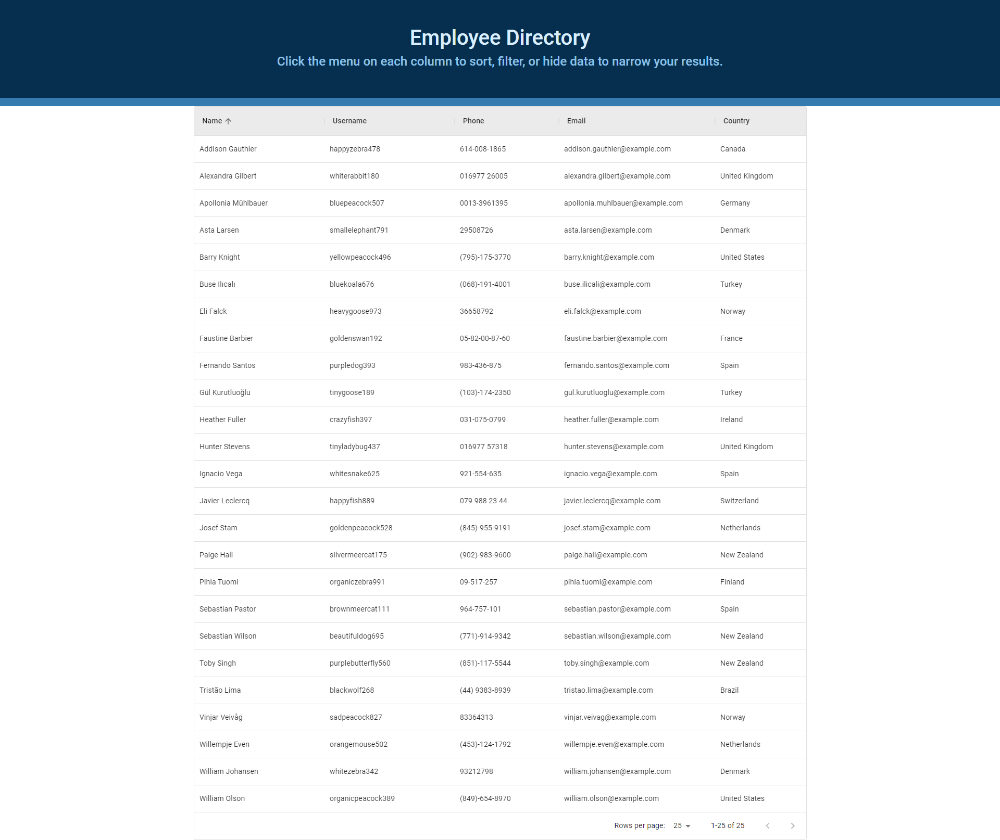
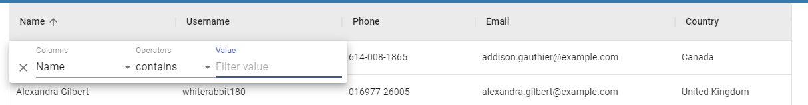
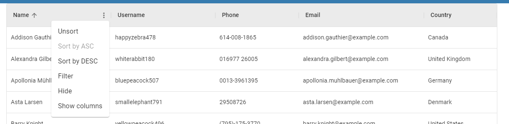

# React Employee Directory

## Links:

Deployed Application:  
Repository: https://github.com/mbussert/react-employee-directory

## Description:

A simple and easy-to-use employee directory application built with React and Material-UI. Each column of data is sortable (asc & desc), searchable, and can also be filtered and hidden to allow the user to narrow their results. The application makes an API call, parses the response and automatically builds out the table. A user is able to view 25, 50, or 100 employees per page.

## Table of Contents:

- [Installation](#installation)
- [Usage](#usage)
- [License](#license)
- [Contributing](#contributing)
- [Testing](#tests)
- [Contact](#contact)

## Installation:

`npm run start` will launch the application on the user's local machine.

## Usage:

A user is able to view, sort, filter, and hide any information in the columns by simply clicking on the menu associated with that column in the respected header.

## License:

This application is covered under the MIT License.

## Contributing:

Users are free to contribute to this project.

## Tests:

No tests have been created for this application.

## Questions:

GitHub: [mbussert](https://github.com/mbussert)  
 By Email: [mbussert@gmail.com](mailto:mbussert@gmail.com)
